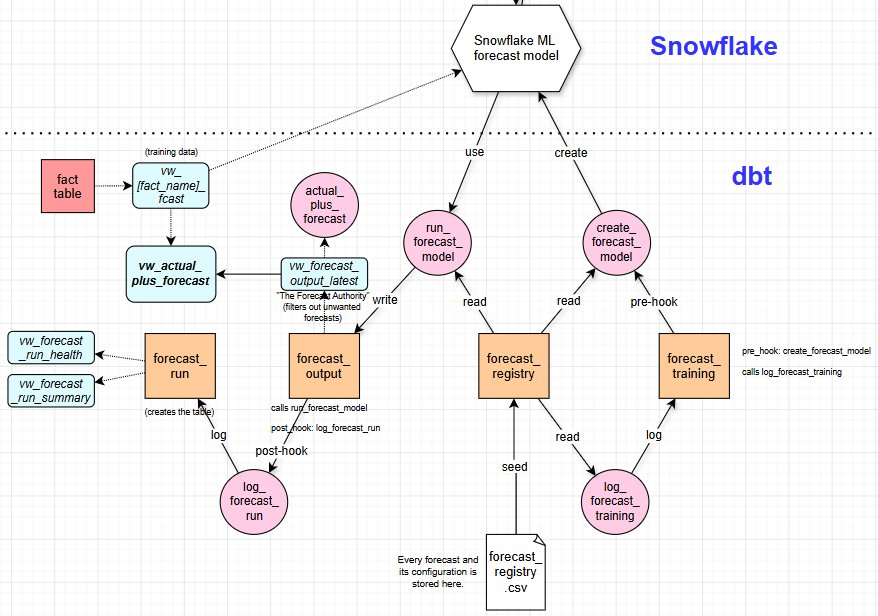
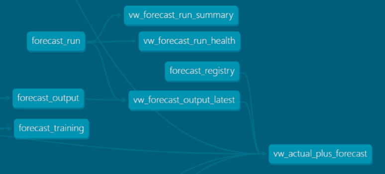

# CareCast

CareCast is a multi-metric time series forecasting application built on **Snowflake ML Forecast** (`SNOWFLAKE.ML.FORECAST`) and orchestrated via dbt. It supports training any number of distinct forecast models, logging all training and run metadata, and producing append-only forecast histories for use in reporting.

---

## Table of Contents

- [How It Works](#how-it-works)
- [Getting Started: Adapting CareCast to a New Environment](#getting-started-adapting-carecast-to-a-new-environment)
- [Adding a New Forecast](#adding-a-new-forecast)
- [Running Forecasts](#running-forecasts)
- [dbt Variables Reference](#dbt-variables-reference)
- [File Reference](#file-reference)

---

## How It Works

Each forecast follows a consistent lifecycle:

```
forecast_registry (seed)          -- defines all model configs
        |
  create_forecast_model (macro)   -- CREATE OR REPLACE SNOWFLAKE.ML.FORECAST
        |
  forecast_training               -- logs training metadata (incremental, append-only)
        |
  run_forecast_model (macro)      -- calls model!forecast(), shapes output
        |
  forecast_output                 -- stores forecast results (incremental, append-only)
        |
  log_forecast_run (macro)        -- inserts execution metadata into forecast_run
        |
  forecast_run                    -- stores run metadata (one row per execution)
```

All forecast models are **disabled by default** and require explicit dbt vars to execute (see [Running Forecasts](#running-forecasts)).

---

## Getting Started: Adapting CareCast to a New Environment

CareCast ships with training input views and `depends_on` statements that are specific to this project's data warehouse. Before you can use it in a new environment, you need to do the following:

### 1. Replace or remove the existing training input views

The `views/` folder contains several views that serve as training data inputs for the existing forecast models. These are environment-specific and **will not work** without the underlying source tables:

| View | Purpose |
|------|---------|
| [vw_fact_care_gap_ff_fcast](views/vw_fact_care_gap_ff_fcast/) | Health plan care gap member counts (monthly) |
| [vw_fact_care_gaps_fqhc_fcast](views/vw_fact_care_gaps_fqhc_fcast/) | FQHC-level care gap aggregates (monthly) |
| [vw_fact_high_utilizer_fcast](views/vw_fact_high_utilizer_fcast/) | FQHC utilization metrics: ED visits, IP admissions, readmissions |

**You must either:**
- Delete these views and create your own (see [Adding a New Forecast](#adding-a-new-forecast)), or
- Replace their SQL with queries against your own data sources

Each training input view must expose at least three columns: a **timestamp** column (date/period), a **series** column (for grouping, e.g., site name or health plan), and a **target** column (the metric to forecast). Column names are configured per model in `forecast_registry.csv`.

### 2. Remove the existing `depends_on` statements

The core models `forecast_output.sql`, `forecast_training.sql`, and `vw_actual_plus_forecast.sql` each contain `-- depends_on: {{ ref(...) }}` lines at the top that reference the existing training input views. These must be replaced to match whichever input views you configure.

**In [forecast_output/forecast_output.sql](forecast_output/forecast_output.sql):**
```sql
-- Remove these lines:
-- depends_on: {{ ref('vw_fact_care_gap_ff_fcast') }}
-- depends_on: {{ ref('vw_fact_high_utilizer_fcast') }}
-- depends_on: {{ ref('vw_fact_care_gaps_fqhc_fcast') }}
-- depends_on: {{ ref('vw_mart_care_gaps_monthly__by_fqhc') }}

-- Replace with your own input view(s):
-- depends_on: {{ ref('your_input_view') }}
```

**In [forecast_training/forecast_training.sql](forecast_training/forecast_training.sql):** Same pattern — remove the existing `depends_on` lines and add one for each of your input views.

**In [views/vw_actual_plus_forecast/vw_actual_plus_forecast.sql](views/vw_actual_plus_forecast/vw_actual_plus_forecast.sql):** This view needs a `depends_on` hint for every unique `input_ref` in `forecast_registry` (one per distinct view name), plus one for `vw_forecast_output_latest`. Keep the `vw_forecast_output_latest` hint and replace the rest:

```sql
-- Always keep this one:
-- depends_on: {{ ref('vw_forecast_output_latest') }}

-- Replace these with your own:
-- depends_on: {{ ref('your_input_view') }}
```

> **Why are these hints needed?** The `actual_plus_forecast()` macro resolves input view references dynamically at runtime by reading `forecast_registry`. dbt cannot detect these as DAG dependencies at compile time, so explicit hints are required to ensure correct build ordering.

### 3. Update `forecast_registry.csv`

Clear the existing rows from `seeds/reference_files/forecast_registry.csv` and add rows for your own forecast models. See [forecast_registry columns](#forecast_registry-seed) below.

Then run:
```bash
dbt seed -s forecast_registry
```

---

## Adding a New Forecast

Once you have the environment set up, adding a new forecast metric is straightforward:

1. **Add a row** to `seeds/reference_files/forecast_registry.csv` with the model configuration.

2. **Seed the registry:**
   ```bash
   dbt seed -s forecast_registry
   ```

3. **Create a training input view** (if the `input_ref` doesn't already exist) in `views/` with your series, timestamp, and target columns. The view name must match the `input_ref` value in the registry.

4. **Add a `depends_on` hint** for the new input view in `forecast_output.sql`, `forecast_training.sql`, and `vw_actual_plus_forecast.sql` if it's a new view not already referenced.

5. **Train the model:**
   ```bash
   dbt run -s forecast_training --vars '{run_forecast: true, model_name: your_model_name}'
   ```

6. **Run the forecast:**
   ```bash
   dbt run -s forecast_output --vars '{run_forecast: true, model_name: your_model_name}'
   ```

> **Note:** `create_forecast_model` automatically filters out any series with fewer than 12 historical data points. Sparse series are silently excluded from training.

---

## Running Forecasts

All forecast models require the `run_forecast: true` var to be enabled. Without it, the models are skipped entirely.

**Train a model** (creates or replaces the Snowflake ML forecast object and logs training metadata):
```bash
dbt run -s forecast_training --vars '{run_forecast: true, model_name: your_model_name}'
```

**Execute a forecast** (calls the model, stores results, logs run metadata):
```bash
dbt run -s forecast_output --vars '{run_forecast: true, model_name: your_model_name}'
```

**Override forecast horizon** (default is set per model in `forecast_registry`):
```bash
dbt run -s forecast_output --vars '{run_forecast: true, model_name: your_model_name, forecast_periods: 24}'
```

You must retrain (`forecast_training`) before the first run and whenever the underlying data changes significantly. After training, you can re-run `forecast_output` as frequently as needed without retraining.

---

## dbt Variables Reference

| Variable | Default | Description |
|----------|---------|-------------|
| `run_forecast` | `false` | Gate flag; must be `true` for any forecast model to execute |
| `model_name` | none | Model name matching a row in `forecast_registry` |
| `forecast_periods` | (from registry) | Number of future periods to predict; overrides the registry value |

---

## File Reference

### Core Models

The following diagram shows the seed file, models, macros, and a small description of their interaction.



The following diagram shows the parent/child relationship of the CareCast models.



#### [forecast_output](forecast_output/)
Incremental, append-only table storing forecast results. Each row is one predicted data point from one forecast run. Populated by the `run_forecast_model()` macro, which calls `model!forecast()` and shapes the output with surrogate keys and run IDs.

#### [forecast_training](forecast_training/)
Incremental, append-only table that logs one row per model training event. Captures training metadata including row counts, date range, and column configuration. Populated by `log_forecast_training()` as the model body, with `create_forecast_model()` running as a `pre_hook`.

#### [forecast_run](forecast_run/)
Incremental table storing execution metadata — one row per `forecast_output` run. Records run timestamp, data cutoff, row count, runtime, status, and any error messages. Populated exclusively by the `log_forecast_run()` post-hook on `forecast_output` (the model itself always returns zero rows).

### Views

#### [vw_actual_plus_forecast](views/vw_actual_plus_forecast/)
The primary reporting view. Unions historical actuals with post-cutoff forecast data for all enabled models in `forecast_registry`. Use this view in dashboards and reports to show a seamless actual-to-forecast trend line. Requires `depends_on` hints for every unique `input_ref` in the registry.

#### [vw_forecast_output_latest](views/vw_forecast_output_latest/)
Returns only the most recent forecast run per model, using the latest data cutoff. Use this when you want current projections only and don't need historical runs.

#### [vw_forecast_run_summary](views/vw_forecast_run_summary/)
Operational summary of all forecast executions, ordered by most recent. Shows run ID, model name, timestamp, data cutoff, row count, runtime in seconds, status, and any error messages.

#### [vw_forecast_run_health](views/vw_forecast_run_health/)
Daily rollup of run success/failure counts and row count statistics per model. Use this to monitor forecast reliability over time and detect anomalies.

#### [vw_fact_care_gap_ff_fcast](views/vw_fact_care_gap_ff_fcast/)
**Environment-specific.** Training input view providing monthly member counts by health plan for the care gap forward-fill forecast. Replace or remove for other environments.

#### [vw_fact_care_gaps_fqhc_fcast](views/vw_fact_care_gaps_fqhc_fcast/)
**Environment-specific.** Training input view providing FQHC-level care gap aggregates (open gaps, closed gaps, member counts, closure rates) by month. Replace or remove for other environments.

#### [vw_fact_high_utilizer_fcast](views/vw_fact_high_utilizer_fcast/)
**Environment-specific.** Training input view providing monthly FQHC-level utilization metrics (ED visits, IP admissions, readmissions). Replace or remove for other environments.

### Configuration

#### `forecast_registry` Seed

Located at `seeds/reference_files/forecast_registry.csv`. Defines all forecast models and their configuration. Every macro in CareCast reads from this seed by `model_name`.

| Column | Description |
|--------|-------------|
| `model_name` | Unique identifier for the forecast model (also the Snowflake ML object name) |
| `input_ref` | dbt view name used as training data input |
| `series_colname` | Column used to partition multi-series forecasts (e.g., site, health plan) |
| `timestamp_colname` | Date/period column |
| `target_colname` | The metric to forecast |
| `forecast_periods` | Default number of future periods to predict |
| `time_grain` | Temporal granularity: `daily`, `weekly`, `monthly`, `quarterly`, or `yearly` |
| `enabled` | Whether the model is active (`true`/`false`); disabled models are excluded from `vw_actual_plus_forecast` |

## 
